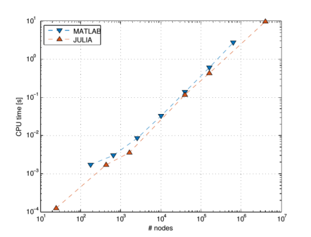

# EllipticFEM.jl &mdash; a FEM Solver for Elliptic Problems Written in Julia
------------------------------------------------------------------------

[](https://travis-ci.org/gerhardtulzer/EllipticFEM)

This package provides an implementation of a 2D finite-element method
for solving elliptic partial differential equations such as the
Poisson equation in Julia. It is possible to prescribe
* arbitrary Dirichlet and/or Neumann boundary conditions,
* an arbitrary right-hand side function, and
* a constant coefficient in the elliptic operator.

The user can provide a mesh generated by GMSH (www.gmsh.info) or
provide the mesh information in the composite type `mesh`.

An important feature of this implementation in Julia is that matrix
assembly is faster than in MATLAB (see Figure).



For plotting, the `PyPlot` package is needed.

# Functions
-----------

## read_mesh

* Input: Path to mesh file.
* Output: Composite type `mesh`.

`read_mesh` reads the GMSH file and creates a composite type `mesh`, which
contains all necessary information about the mesh.

`mesh` contains the following fields:
* `nodes`: 2 &times; nr_nodes array containing the node coordinates
* `edges`: 4 &times; nr_edges array. Lines 1 and 2: nodes forming the
	edge. Line 3: physical property. Line 4: geometrical property
	(defining the boundary condition).
* `elements`: 5 &times; nr_elements array.  Lines 1, 2, and 3: node indices forming the
	triangle. Line 4: physical property. Line 5: geometrical property.

The physical properties are currently not used as well as the
geometrical property of the elements. These quantities may be used to
define subdomains later.

## assemble

* Input: mesh `mesh`, ellipticity constant `A`, right-hand side
	function `f`, boundary data `bddata`.
* Output: stiffness matrix `M`, right-hand side vector `b`.

`assemble` takes the named input and provides the stiffness
matrix and right-hand side vector.  The input needs to be as follows:
* `mesh::mesh`.
* `A::Float64`: only constants are allowed.
* `f::Function`: a function of two arguments, e.g. `(x,y) -> x+y`
* `bddata::Array`: 3 &times; n Array, where n is the number of different
edge physical properties defined in the GMSH file. The first row needs
to contain the physical properties, the second row contains either
`'D'` (for a Dirichlet boundary) or `'N'` (for a Neumann boundary) at
the respective type of edge. The third row contains a function of two
coordinates giving the value of the solution on the boundary,
e.g. `(x,y) -> 0` for homogeneous conditions.

## solve

* Input: path to meshfile, ellipticity constant `A`, right-hand side
	function `f`, boundary data `bddata`.
* Output: mesh, solution `u`.

`solve` combines `read_mesh` and and `assemble`, and
furthermore uses the backslash operator to calculate the solution `u`.

## plot_solution 

* Input: mesh, solution `u`.
* Output: 3D surface plot of the solution.

`plot_solution` plots the solution over the mesh.

## calculate_norm 

* Input: mesh, solution `u`.
* Output: 2-norm of the solution.

`calculate_norm` calculates the 2-norm of the solution using a first-order 
integration rule.

# An Example
------------------

The code and also the mesh file for this example are stored in the test folder.
Using `run_fem` is the most convenient way to obtain a solution:

First, the path of the mesh file, the coefficient `A`, the right hand side
function `f`, and the boundary data need to be prescribed.

```
meshpath = "mesh_p05.msh";
A = 1.0;
f = (x,y) -> 5/4*pi^2*cos(x*pi/2)*sin(y*pi);
bddata = [1 2 3 4;
		'D' 'N' 'D' 'N';
		(x,y)->0 (x,y)->-pi/2*sin(x*pi/2)*sin(y*pi) (x,y)->0 (x,y)->pi/2*sin(x*pi/2)*sin(y*pi)];
mesh, u = solve(meshpath, A, f, bddata);
```

Then the solution is plotted using `plot_solution`:

`plot_solution(mesh, u)`


The exact solution in this example is `cos(x*pi/2) * sin(y*pi)`.

The norm can be obtained via `calculate_norm`:
`calculate_norm(mesh,u)`


# Authors
---------

* Caroline Geiersbach
* Clemens Heitzinger (Clemens.Heitzinger@TUWien.ac.at, http://Clemens.Heitzinger.name)
* Gerhard Tulzer (Gerhard.Tulzer@TUWien.ac.at)
